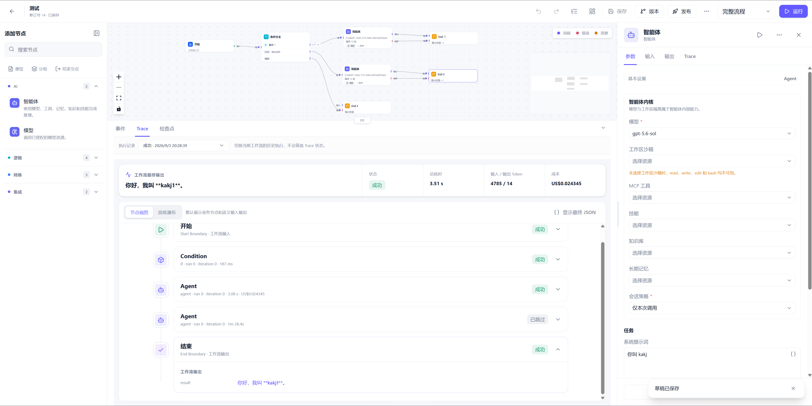

# Agentx


Agentx 是一个面向企业场景的开源 Agent 工作流平台，提供可视化 Workflow 编排、模型与 MCP 资源管理、在线调试、应用发布、执行追踪、审批恢复和运行治理。

> 当前版本为 `v0.0.2-beta`，仍处于快速开发阶段，不保证历史数据和旧协议兼容。未经容量、安全、备份恢复和隔离评审，不建议直接用于生产环境。

## 核心能力

- Workflow 5.0：可视化编排、强类型参数、表达式、上下文、分支、循环和子工作流。
- Agent Runtime：模型调用、工具循环、MCP、Skill、RAG、Memory、代码沙箱与 Artifact。
- 应用交付：不可变版本发布、API Key、Webhook、定时任务、参数测试和多轮会话。
- 运行治理：Execution、审批、等待、Checkpoint、Fork、恢复、成本统计和 Trace。
- 企业资源：部门、用户、运行身份、资源授权、模型服务、凭证、MCP、Skill 和知识资源。



## 架构

| 逻辑域 | Helm Release | 物理 Namespace | 主要组件 |
|---|---|---|---|
| Control | `agentx-control` | `agentx-control` | Web Console、Platform Control、可选 Control MySQL |
| Runtime | `agentx-runtime` | `agentx-runtime` | Gateway、Runtime、Worker、Sandbox Manager、可选 MySQL/Redis |
| Observability | `agentx-observability` | `agentx-runtime` | Observability、可选 ClickHouse |
| Dependencies | `agentx-dependencies` | `agentx-deps` | Egress Gateway、local/test Vault 与 MinIO |

核心 Kubernetes 资源只由 Helm 管理。Kustomize 仅用于可选 Addon 和临时 E2E Fixture。OpenSandbox 使用官方独立安装流程，Agentx 只验证和接入 Lifecycle API。

详细设计见[产品与架构文档](docs/README.md)和[部署手册](deploy/README.md)。

## 快速部署 Docker Hub Beta

前置条件：

- 对应平台的 `agentxctl` 单文件二进制；
- Helm 3、kubectl 和一个可访问且具有默认 StorageClass 的 Kubernetes 集群；
- 集群可以拉取 Docker Hub、ingress-nginx 和基础依赖镜像；
- OpenSandbox 已独立安装，并可从 Agentx Runtime Namespace 访问。

### Windows x64

[直接下载 `agentxctl-windows-x86_64.exe`](https://github.com/kakj-go/Agentx/releases/download/agentxctl-v0.0.2-beta/agentxctl-windows-x86_64.exe)（[SHA-256](https://github.com/kakj-go/Agentx/releases/download/agentxctl-v0.0.2-beta/agentxctl-windows-x86_64.exe.sha256)）

下载完成后，在 PowerShell 进入下载目录并直接安装：

```powershell
Set-Location $HOME\Downloads
.\agentxctl-windows-x86_64.exe install
```

### Linux x64

[直接下载 `agentxctl-linux-x86_64`](https://github.com/kakj-go/Agentx/releases/download/agentxctl-v0.0.2-beta/agentxctl-linux-x86_64)（[SHA-256](https://github.com/kakj-go/Agentx/releases/download/agentxctl-v0.0.2-beta/agentxctl-linux-x86_64.sha256)）

浏览器下载不会保留 Linux 可执行权限，因此首次运行前需要执行一次 `chmod`：

```bash
cd ~/Downloads
chmod +x agentxctl-linux-x86_64
./agentxctl-linux-x86_64 install
```

不传 `--values` 时，单文件二进制使用与当前 CLI 版本绑定的内嵌 Docker Hub Beta 配置。安装命令会完成 Values、工具、集群、三个 Namespace、Secret、ingress-nginx、四个 Helm Release、Migration、Bootstrap、Rollout 和 Helm Doctor。任一步失败都会返回非零退出码，Helm 使用 `--atomic --wait --wait-for-jobs` 回滚本次失败发布。

查看状态和运行 Doctor：

```bash
./agentxctl-linux-x86_64 status --output json
./agentxctl-linux-x86_64 doctor
```

Windows 使用相同子命令，将二进制名称替换为 `.\agentxctl-windows-x86_64.exe` 即可。自定义或 production 部署必须显式提供 `--values <文件>`。

本地访问 Web Console：

```bash
kubectl -n agentx-control port-forward service/web-console 18080:8080
```

打开 `http://127.0.0.1:18080`，按页面提示完成公司初始化。

普通卸载保留 Namespace、PVC 和外部资源：

```bash
./agentxctl-linux-x86_64 uninstall --target all
```

如需同时删除 local/test 的三个 Namespace 和持久化数据，必须显式确认：

```bash
./agentxctl-linux-x86_64 uninstall --target all --purge-data --yes
```

production Values 会直接拒绝 `--purge-data`。执行清理前请确认不再需要 PVC 中的数据；普通卸载不会删除 Namespace、PVC 或外部依赖。

## 已发布镜像

当前 Beta 镜像均为 Linux AMD64，标签为 `v0.0.2-beta`。

| 镜像 | 用途 |
|---|---|
| `kakj/agentx-web-console:v0.0.2-beta` | Web 管理控制台 |
| `kakj/agentx-platform-control:v0.0.2-beta` | Control API、发布和投影 |
| `kakj/agentx-runtime-gateway:v0.0.2-beta` | 应用调用和 Runtime 查询入口 |
| `kakj/agentx-workflow-runtime:v0.0.2-beta` | 调度、恢复和后台角色 |
| `kakj/agentx-workflow-worker:v0.0.2-beta` | 节点与 Agent 执行 |
| `kakj/agentx-sandbox-manager:v0.0.2-beta` | OpenSandbox 生命周期适配 |
| `kakj/agentx-egress-gateway:v0.0.2-beta` | 受控公网出口 |
| `kakj/agentx-observability:v0.0.2-beta` | Trace 摄取和查询 |
| `kakj/agentx-migrate:v0.0.2-beta` | MySQL/ClickHouse Migration |
| `kakj/agentx-bootstrap:v0.0.2-beta` | 幂等初始化检查 |
| `kakj/agentx-doctor:v0.0.2-beta` | 部署后依赖与权限检查 |

## 本地开发与测试

除部署前置条件外，开发需要 Rust、Node.js 24、pnpm 11 和 Docker。

```bash
corepack enable
pnpm install --frozen-lockfile
uv sync --frozen --group test
uv run --frozen --group test ruff check .
uv run --frozen --group test pytest tests/acceptance
cargo test --workspace
pnpm --filter @agentx/web test
pnpm build:web
```

统一门禁：

```bash
cargo xtask check
```

本地构建并导入 Kubernetes 镜像：

```bash
cargo xtask images --values deploy/values/local.yaml
```

领域 E2E 使用临时 Namespace；浏览器场景仍由 TypeScript Playwright 执行：

```bash
uv run --frozen --group test pytest tests/e2e --values deploy/values/local.yaml -m infrastructure
uv run --frozen --group test pytest tests/e2e --values deploy/values/local.yaml -m product
```

## 文档

- [产品与架构索引](docs/README.md)
- [系统架构](docs/02-system-architecture.md)
- [Kubernetes 部署契约](docs/07-deployment.md)
- [部署与运维手册](deploy/README.md)
- [E2E 测试规范](docs/plan/e2e-testing-standard.md)
- [OpenSandbox 接入](deploy/opensandbox/README.md)

## 许可证

项目使用 [Apache License 2.0](LICENSE)。
