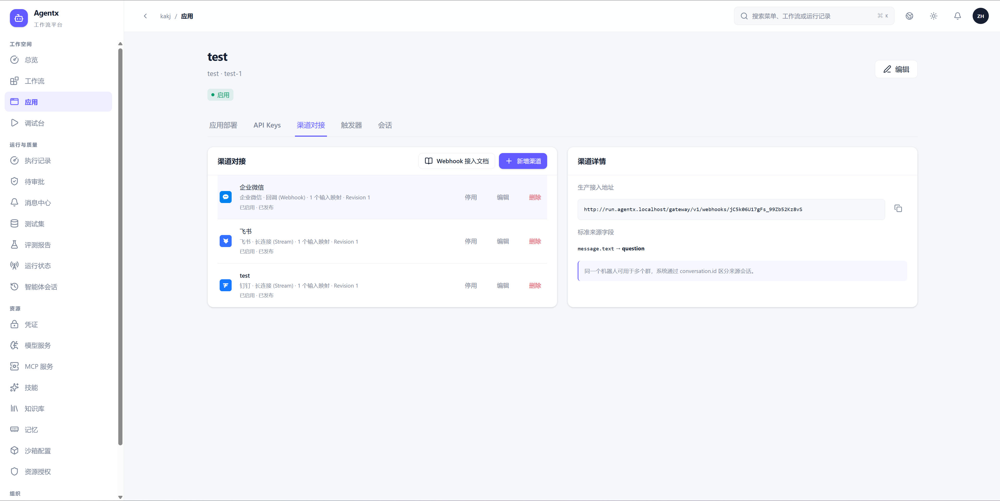
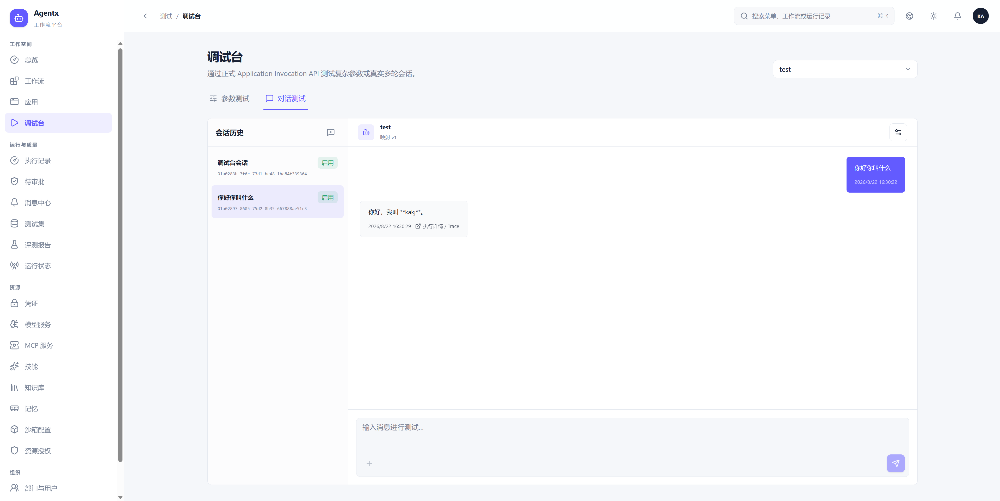
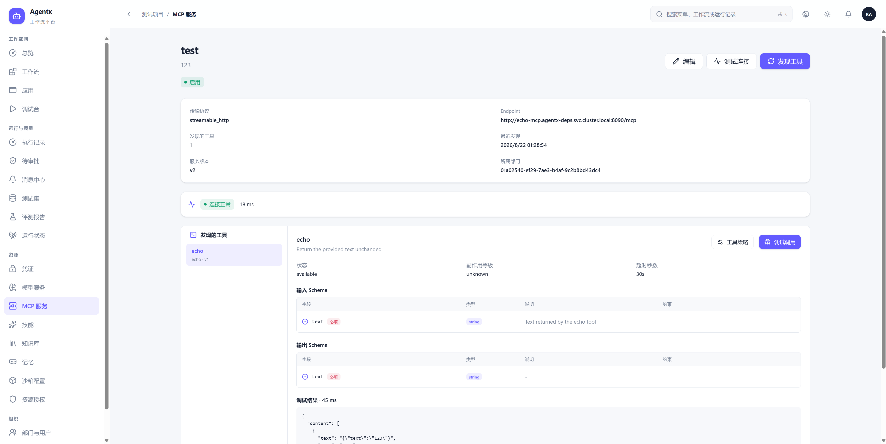

# Agentx


Agentx 是一个面向企业场景的开源 Agent 工作流平台。它提供可视化 Workflow 编排、模型与 MCP 等资源管理、在线调试、应用发布、执行追踪、审批恢复和运行治理能力，帮助团队把 Agent 从流程设计推进到可部署、可观测的应用。

> 当前版本为 `v0.0.1-beta`，仍处于快速开发阶段。项目暂不保证历史数据和旧协议兼容，不建议未经安全评审直接用于生产环境。

## 功能概览

### 可视化工作流与执行追踪

通过画布组合模型、Agent、MCP、代码、条件、循环、审批、等待等节点。运行结果按开始、节点和结束展示，支持查看输入输出、Token、成本、耗时以及高级 Trace。


### 应用发布与触发器

将不可变 Workflow Version 发布为应用，通过 API Key、Webhook、定时触发和会话入口对外提供能力。应用调用使用版本化输入输出契约，运行记录可以追溯到具体发布版本。



### 参数与对话调试

调试台直接调用正式 Application Invocation API，支持按 Schema 生成参数表单、上传 Artifact、管理会话映射，并从对话消息跳转到 Execution 和 Trace。



### MCP 服务管理

集中维护 MCP 服务、连接状态和工具发现结果，展示工具输入输出 Schema，并支持连接测试、工具策略和在线调试调用。



## 核心能力

- Workflow 5.0：可视化编排、强类型参数、表达式、上下文、分支、循环和子工作流。
- Agent Runtime：模型调用、工具循环、MCP、Skill、RAG、Memory、代码沙箱与 Artifact。
- 应用交付：版本发布、环境部署、API Key、Webhook、定时任务、参数测试和多轮会话。
- 运行治理：执行记录、审批、等待、Checkpoint、Fork、恢复、成本统计和 Trace 瀑布。
- 企业资源：部门与用户、运行身份、资源授权、模型服务、凭证、MCP、Skill 和知识资源。
- 三域架构：Control、Runtime、Observability 权威边界分离，通过版本化契约和 Outbox 协作。

## 架构概览

| 逻辑域 | 主要职责 | 核心服务 |
|---|---|---|
| Control | Workflow、应用、资源、权限、发布和管理 API | Web Console、Platform Control |
| Runtime | 调用入口、执行调度、Worker、恢复和沙箱管理 | Runtime Gateway、Workflow Runtime、Workflow Worker、Sandbox Manager |
| Observability | Trace 摄取、查询和诊断 | Observability |
| Dependencies | 受控公网出口和基础依赖 | Egress Gateway、MySQL、Redis、ClickHouse、MinIO、Vault |

详细设计见 [产品与架构文档](docs/README.md) 和 [Kubernetes 部署说明](deploy/README.md)。

## 使用 Docker Hub 镜像快速部署

### 前置条件

- 一个可用的 Kubernetes 集群，集群具有默认 StorageClass。
- `kubectl` 和 PowerShell 7；Linux 一键脚本使用 Bash 调用同一套 PowerShell 部署器。
- 能够访问 Docker Hub、Helm Chart 仓库和 Kubernetes 镜像仓库。
- 已独立安装 OpenSandbox，并保证 `agentx-deps` 中的 Agentx Pod 可以访问其 Lifecycle API。安装边界见 [OpenSandbox 接入说明](deploy/opensandbox/README.md)。

仓库提供 `deploy/profiles/v2-dockerhub-beta.json`，会直接拉取 `kakj/agentx-*:v0.0.1-beta`，无需在部署机器编译 Agentx。

克隆仓库：

```text
git clone https://github.com/kakj-go/Agentx.git
cd Agentx
```

Windows 使用 PowerShell 一键安装：

```powershell
pwsh ./scripts/install.ps1
```

Linux 使用 Bash 一键安装：

```bash
bash ./scripts/install.sh
```

一键脚本会依次完成部署配置校验、Agentx 安装和安装后健康检查，任一阶段失败都会立即停止并返回非零退出码。

如果 OpenSandbox 的地址或 Service 名称不同，请先修改 Profile 中的 `components.sandbox.endpoint`。该 Beta Profile 会创建三个 Namespace，并安装本地开发所需的 MySQL、Redis、ClickHouse、MinIO、Vault 和专用 ingress-nginx。

检查工作负载：

```powershell
kubectl get pods -n agentx-control
kubectl get pods -n agentx-runtime
kubectl get pods -n agentx-deps
```

本地访问 Web Console：

```powershell
kubectl -n agentx-control port-forward service/web-console 18080:8080
```

浏览器打开 `http://127.0.0.1:18080`，首次进入时按页面提示完成公司初始化。

卸载应用资源时执行：

```powershell
pwsh ./scripts/deploy-v2.ps1 -Action Uninstall -Target All -ConfigFile deploy/profiles/v2-dockerhub-beta.json
```

普通卸载会保留 Namespace 和持久化数据。需要清理测试数据时，请先阅读 [部署手册](deploy/README.md)，确认资源所有权后再操作。

## 已发布镜像

当前 Beta 镜像均为 Linux AMD64，统一使用标签 `v0.0.1-beta`。

| 镜像 | 用途 |
|---|---|
| `kakj/agentx-web-console:v0.0.1-beta` | Web 管理控制台 |
| `kakj/agentx-platform-control:v0.0.1-beta` | 控制面 API、发布与投影 |
| `kakj/agentx-runtime-gateway:v0.0.1-beta` | 应用调用、会话与 Runtime 查询入口 |
| `kakj/agentx-workflow-runtime:v0.0.1-beta` | Workflow 调度、恢复和后台角色 |
| `kakj/agentx-workflow-worker:v0.0.1-beta` | 节点与 Agent 执行 Worker |
| `kakj/agentx-sandbox-manager:v0.0.1-beta` | OpenSandbox 生命周期适配 |
| `kakj/agentx-egress-gateway:v0.0.1-beta` | Model、MCP 等外部请求的受控出口 |
| `kakj/agentx-observability:v0.0.1-beta` | Trace 摄取和查询 |
| `kakj/agentx-migrate:v0.0.1-beta` | MySQL 与 ClickHouse Schema 初始化 |
| `kakj/agentx-bootstrap:v0.0.1-beta` | 集群初始化任务 |
| `kakj/agentx-doctor:v0.0.1-beta` | 部署后依赖与权限检查 |

## 本地开发

主要依赖：Rust、Node.js 24、pnpm 11、Docker、PowerShell 7 和 kubectl。

```powershell
corepack enable
pnpm install --frozen-lockfile
cargo test --workspace
pnpm --filter @agentx/web test
pnpm build:web
```

运行完整本地门禁：

```powershell
pwsh ./scripts/check.ps1
```

本地构建开发镜像：

```powershell
pwsh ./scripts/build-images.ps1
```

## 文档

- [产品与架构文档索引](docs/README.md)
- [系统架构](docs/02-system-architecture.md)
- [Workflow 引擎](docs/03-workflow-engine.md)
- [Runtime 治理与 Trace](docs/04-runtime-governance.md)
- [前端架构](docs/10-frontend-architecture.md)
- [Kubernetes 部署手册](deploy/README.md)
- [OpenSandbox 接入](deploy/opensandbox/README.md)

## 参与贡献

欢迎通过 Issue 和 Pull Request 参与改进。提交前请阅读 [AGENTS.md](AGENTS.md) 中的工程约束，并至少运行与改动相关的测试；涉及完整业务流程时需要补充 Kubernetes E2E。

## 许可证

本项目使用 [Apache License 2.0](LICENSE)。
