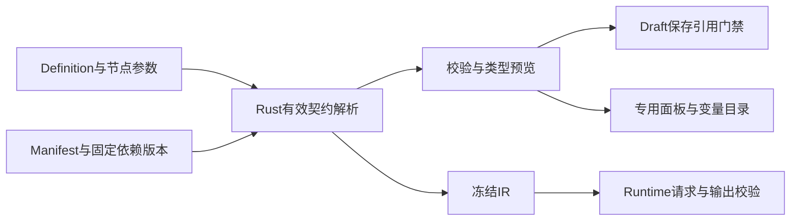

# plan5 架构评估与完成证据

完成复核日期：2026-09-02。范围是当前工作树中支撑Workflow Studio与节点执行的架构；目标和任务分别见 [README.md](README.md)、[implementation-plan.md](implementation-plan.md)。A1–A7与plan5.1保留为历史基线；plan5.2已按自然输入、无公共投影、Code示例Schema、TCP Gateway和可拖拽Inspector的新边界完成本地与Kubernetes验收，最终运行ID为`b06f984b05`。

## 1. 结论与可信边界

**总体分层已保留，Control/Runtime/Observability边界和既有技术栈没有重做。Catalog所有权、有效契约、审批状态、画布投影、终态路径、Provider出口、Schema清单和文件边界已经按A1–A7完成局部收敛。**

最终核对覆盖Cargo依赖、目录/契约生成、编译与序列化、子执行、审批、终态、出口和文件边界；`agentx-boundary-check`已通过，原5项失败全部关闭。

本次已重跑完整本地测试和20项Kubernetes系统E2E（运行ID `421d4360aa`），但没有执行生产容量、PITR/RPO/RTO、强隔离或供应链安全认证。它们仍以 [V2架构当前状态](../13-architecture-service-data-map.md) 和V2-08B门禁为准，不能由plan5完成替代。

| 问题类别 | 例子 | 处理方式 |
|---|---|---|
| 展示/交互实现差距 | 字号、控件高度、重复输出、变量选择层级、附件管理按钮 | 在统一组件层和专用面板完成，不改运行架构 |
| 节点能力 | Loop/List数组输入、并行上限、模型结构化输出、Code命名输入 | 已补原生契约、输入求值、执行消费和验证 |
| 局部架构/模型 | 多处推导输出类型、Catalog来源重叠、decision充当任务状态、终态清理分叉 | 已按A1–A6明确唯一职责和权威来源 |
| 架构边界 | 出口初始化失败后直连、Schema清单漂移、生产文件超行数 | 已按A7修正实现和一致性，守卫要求未降低 |

## 2. 保留的架构基座

| 边界 | 保留内容 | 原因与限制 |
|---|---|---|
| Control / Runtime / Observability | 管理面、运行面、观测面通过冻结契约通信，存储权限分开 | 工作流运行不依赖可变Control草稿；不为补UI跨库直读 |
| Domain / Compiler / State Machine | 纯领域与编译/调度语义不依赖SQL、Redis或Provider I/O | 业务语义可独立测试；实际存储、派发和外部调用留在服务/Adapter |
| Revision / Version / Snapshot | 编辑草稿、不可变版本和执行快照分离 | Worker消费冻结运行输入，不能每步再读取Draft Head或当前资源配置 |
| Definition / Editor Document / Debug Overlay | 运行语义、位置/视口/注释、调试数据分别保存 | React Flow临时节点、Pin/Mock、运行高亮不进入正式Definition |
| MySQL / Redis / ClickHouse / OSS | MySQL业务权威与事务，Redis派发/缓存，ClickHouse观测，OSS大对象 | 消息可重复投递，Trace可延迟；二者都不能成为业务状态的替代权威 |
| 前端基础设施 | React Flow、现有组件库、Lexical、Monaco、ELK、Zustand与TanStack Query | 复用已有编辑/布局/历史/授权能力，不新建画布或表达式引擎 |

当前Cargo依赖中，`agentx-runtime`保持纯契约/算法依赖；Control与Runtime分别使用所属Infrastructure。静态检查未报告Cargo跨面直接依赖错误，但这不证明所有运行路径均合规，A7已发现具体例外。

三域分离带来发布、投影延迟、幂等和运维成本；现阶段应收敛现有链路，而非继续按节点类型拆服务。资源占用和容量是否合适需要运行指标验证，本次不以主观判断重新合库或增加基础设施。

## 3. 局部架构优化

### A1 节点目录与资源执行能力分开，元数据来源唯一

原问题（已收口）：[catalog_api.rs](../../src/services/platform-control/src/catalog_api.rs) 的 `manifests_for_tenant` 先收集数据库Manifest，再补 `NodeRegistry::m5_defaults`；相同类型/版本会受来源优先级影响。运行Registry仍包含资源节点，直接对外暴露会把不应独立创建的技能/工具等带入Studio。

目标：

- 设计器只暴露目标Workflow节点；Agent资源能力仍由已有资源/附件执行路径承担，不因为隐藏画布入口而误删运行器。
- 内置节点定义明确由Rust Registry及其生成物拥有；数据库中的不可变快照必须与来源及hash一致，不能静默覆盖同一版本的内置定义。
- 已发布子流程的派生契约来自其固定版本，不能再手工维护另一份可变描述。
- 前端读取同一份分类、图标key、字段、端口、槽位和业务文案；前端仅将语义分类映射成视觉令牌。
- 在现有Registry/Catalog模块中整理职责，不新增独立Catalog服务、样式配置服务或泛化的插件配置层。

验收：目录、编译、发布使用同一类型/版本/hash；旧数据库行不能让UI拿到与编译器不同的契约；资源能力不作为第二套可编辑Workflow节点。

### A2 有效节点契约只由同一套Rust逻辑生成

原问题（已收口）：[compiler.rs](../../src/crates/agentx-runtime/src/compiler.rs) 的输出Schema推导、[bundle-builder](../../src/crates/agentx-bundle-builder/src/lib.rs) 的子流程Schema生成、[reference-path.ts](../../src/web/src/features/workflow-designer/forms/reference-picker/reference-path.ts) 的目录构建分处多处，已经出现all_complete标量/数组及动态端口不一致。

目标：在现有编译模块内提取可复用的纯函数/小模块，以Manifest、节点参数、固定依赖版本和图关系为输入，统一计算有效输入/输出Schema、动态端口、基数、敏感性与引用能力。不是新建Schema服务。IR显式保存Exit定义顺序；`all_complete`按实际到达Exit对齐字段数组，可选缺失写null并同步元素Schema，不能依赖BTreeMap顺序或生成不同长度的相关字段数组。

在现有校验/预览API中提供必要的有效契约；静态Manifest继续使用同源生成物，不另写一套正式类型推导。无需每次输入一个字符都重新请求完整编译。前端可做即时显示和轻量合法性提示，但不维护另一套正式类型推导。半配置节点应明确显示未知/待配置，不能猜造类型。

Draft保存复用同源的轻量引用校验，只检查已经填写的递归InputBinding是否来自execution边可达前驱、作用域/端口是否合法并能按目标Schema直接兼容或严格转换；不强迫半成品草稿满足发布级必填配置。Picker没有目标节点时输出目录为空，Exit main/error使用各自虚拟目标；断线旧引用保留并由保存返回字段级错误，revision不前进。

Runtime只消费冻结IR中的契约，不能为了“统一解析”在运行时回查Control或Draft。前端业务布局仍由13类专用面板负责，后端Schema不承担像素布局。

验收：相同Definition/依赖版本在编辑预览、Draft保存、编译、Bundle、父流程引用和运行结果中得到一致类型与引用结论；修改一条推导规则无需在多个层次补不同规则。

### A3 运行图为权威，画布只是可逆的视图投影

原问题（已收口）：[connections.ts](../../src/web/src/features/workflow-designer/utils/connections.ts) 的chip控制边归一、[workflow-flow.tsx](../../src/web/src/features/workflow-designer/canvas/workflow-flow.tsx) 的容器投影与尺寸处理、[serializer.ts](../../src/web/src/features/workflow-designer/model/serializer.ts) 共同影响图语义，容易让纯UI辅助节点介入执行定义。

目标：

- Definition拥有真实节点、真实边和parentId；Editor Document拥有父相对坐标、尺寸、视口及注释；Debug/Runtime Overlay各自隔离。
- chip、派生入口线、视觉Group、临时Handle位置和测量结果不作为运行语义权威。Serializer只转换保存格式，不承担修补或改写执行图的职责。
- 复用现有editor-store动作与历史事务，将拖入/拖出容器时的归属、坐标、相关边修改作为一个可撤销编辑；不再新增Command Bus或第二个编辑状态库。
- React Flow投影负责父节点先于子节点、尺寸、测量、层级与边界；GraphIndex与编译器读取真实拓扑，不能依赖chip是否渲染出来。

React Flow已有父子关系、父相对坐标和边界约束能力，适合继续使用；无需自行实现这一套画布机制。[React Flow Sub Flows](https://reactflow.dev/learn/layouting/sub-flows)

验收：删除/重建所有纯UI派生对象不会改变Definition；保存重开、拖动、resize、复制粘贴和撤销后运行图一致；chip可见且子节点不越界。

### A4 审批生命周期与业务决策分开，Runtime拥有最终裁决

原问题（已收口）：[publish.rs](../../src/services/agentx-v2-runtime/src/publish.rs) 将自定义decision直接作为task.status，恢复与审计分支又只处理固定approved/rejected；这属于状态模型耦合，不能仅补一个按钮回调。

目标：固定任务生命周期，独立保存decision ID与buttons快照；显示名不参与路由。所有业务决策统一走Decide，删除旧双接口与兼容映射。

Control负责用户权限入口与治理展示，投影可以用于界面和前置检查；最终任务版本、认领状态、按钮归属、幂等和执行是否已终态，必须由Runtime在事务中校验。投影延迟不能成为绕过最终校验或伪造成功状态的理由。

验收：按钮改名不改变路由，非法/过期/重复决策不能恢复执行；投影迟到、重复或重建后状态一致。仅修改Workflow运行审批，资源授权审批域不改。

### A5 所有执行终态共用收尾规则

原问题（已收口）：[engine_persistence.rs](../../src/services/agentx-v2-runtime/src/engine_persistence.rs) 的 `finish_execution` 与 [execution.rs](../../src/services/agentx-v2-runtime/src/execution.rs) 的 `process_cancel_command` 分别收尾；挂起审批清理只在显式取消路径看到，首次返回路径容易遗漏。

目标：在现有Runtime应用层集中终态收尾职责，让成功、失败、首次返回、取消、超时共享“哪些激活/审批/子执行/资源必须失效或释放”的规则。状态机仍负责决定终态，存储层负责原子落地，不把SQL或Provider I/O放进纯状态机。

同库业务状态、任务失效和必要Outbox记录在事务内一起提交；跨进程取消/释放由已有命令处理器幂等执行，不在长事务里等待外部Provider。业务状态与通知同事务、消费方处理重复消息是成熟Outbox模式的要求。[AWS Transactional outbox](https://docs.aws.amazon.com/prescriptive-guidance/latest/cloud-design-patterns/transactional-outbox.html)

不增加终态服务、另一套取消器或通用事件溯源框架，不承诺撤销已经发生的外部副作用。Trace只是观测证据，不能替代终态权威。

验收：任意终态入口都不留下可继续操作的审批或永远等待的父/子执行；重复处理不重复结算；取消命令迟到不会复活已完成流程。

### A6 子流程只有一套配置与输入准备路径，Loop不升级成子Execution集群

原问题（已收口）：[bundle-builder](../../src/crates/agentx-bundle-builder/src/lib.rs) 能生成Composite inputs Schema，但 [composite_execution.rs](../../src/services/agentx-v2-runtime/src/composite_execution.rs) 的 `create_child` 仍直接从activation.inputs取值，公开配置与实际输入消费没有统一。

目标：设计器只有一个sub_workflow入口，选择固定版本后使用其契约；显式映射在父上下文求值并校验，再传给子执行。内部派生Manifest可以继续作为编译产物，但不能成为另一套公开节点/输入协议。

Loop处理的是用户选择的数组，在同一Execution内按元素激活子DAG；子流程调用才创建独立子Execution。输入数组、每轮item/index及数组结果是可复用的交互模式，但不照搬外部平台的内部执行或存储协议。[Dify Iteration](https://docs.dify.ai/en/cloud/use-dify/nodes/iteration)

验收：更改映射确实改变子输入；父端类型与子结果一致；循环元素数量不会变成同量独立Execution，仍受现有预算、租约和恢复机制约束。

### A7 现有出口、Schema和模块边界必须真正落实

本项沿用已有架构约束完成整改，没有引入新服务或降低守卫：

- 生产Provider HTTP与WebSocket统一走受控传输；配置或客户端初始化失败时拒绝请求，不存在裸客户端直连fallback。
- 测试Fixture使用明确的集群内隔离路径；NetworkPolicy、Provider Client守卫和负向边界测试均保持启用。
- 已删除wait表同步到当前表处置/所有权清单，没有恢复过期表。
- 超2000行的Compiler、Agent Runtime和Control入口已按原职责拆分；生产前后端文件扫描无超限项。

## 4. 本次架构门禁结果

执行：`cargo run --quiet -p agentx-boundary-check -- check .`。结果：通过。

| 原失败项 | 最终处理 |
|---|---|
| Runtime初始化Schema缺少execution_resume_tokens、wait_subscriptions | 删除项已同步到表处置/所有权输入；未恢复旧表 |
| stream/mod.rs直接引用reqwest Client/ClientBuilder | HTTP与WSS均改为受控Provider出口，失败即拒绝 |
| compiler.rs超2000行 | 引用校验等职责拆到同crate小模块 |
| worker_runtime_agent_core.rs超2000行 | Budget、State、Model、Trace等职责拆分，Agent Core边界不变 |
| platform-control/control_api.rs超2000行 | Webhook DTO/校验与路由职责拆到application_webhooks/control_api_webhooks |

检查器使用 `docs/planv2/contracts/table-disposition.json` 与 `v2-schema-table-ownership.json` 等当前守卫输入。修改这些输入必须有实际表删除/所有权变更依据，不能仅为得到绿灯删除规则或增加例外。

Schema漂移、Provider出口负向测试、Cargo/SQL/Secret/NetworkPolicy守卫及2000行检查共同通过；没有通过修改限制、增加豁免或恢复旧表取得绿灯。

## 5. 落到现有实施计划

| 架构项 | 对应任务 | 完成证据 |
|---|---|---|
| A1目录/元数据来源 | M0、M1、F2 | Catalog、Registry、快照hash与可创建类型一致 |
| A2有效契约 | M0、M4.1/M4.2/M4.4/M4.6/M4.7/M4.8、F7 | 同源推导、Draft保存引用门禁与跨层契约测试，父子类型一致 |
| A3画布投影 | M5、F1/F3/F4/F5/F7/F8 | round-trip、节点操作闭环、编辑历史、容器与无UI节点的运行测试 |
| A4审批状态 | M4.3 | 第三按钮、版本/权限/幂等、投影延迟与失效任务测试 |
| A5终态收尾 | M4.4、M5、M6 | 所有终态入口的统一清理矩阵和恢复测试 |
| A6子流程/循环分工 | M4.6、M5 | 映射真实消费与循环预算/恢复验证 |
| A7约束落地 | M0整改清单、M6门禁 | 出口失败拒绝测试、Schema一致性、边界检查全绿 |

A1–A7已随各垂直切片落地，没有另起整体架构重写阶段。docs/02、03、09、10、11、12、13和总索引已同步当前事实；生产认证边界仍与本地功能完成分开记录。

## 6. 明确不做

- 不换工作流引擎，不新建Catalog、Schema、循环或终态服务，不新增数据库/消息中间件/通用配置层。
- 不为每个Loop元素创建独立Execution，不把Control投影作为Runtime权威，不让Worker回读可变Control配置。
- 不重做现有权限、资源中心、表达式协议、运行快照、前端状态库或组件技术栈。
- 不为历史数据或旧代码保留迁移、双读、别名、旧路由包装或兼容性fallback；继续遵守README第0节。
- 不将此次静态审查、少量单测或demo完成等同于生产容量、安全、高可用与灾备认证。
