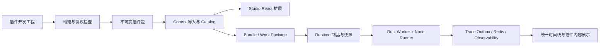

# 节点包架构、契约和数据分域

状态：部分完成。Runtime 契约已生成；Canvas Plugin 管理 DTO 仍为手写类型且 OpenAPI 响应缺 Schema，见 `evidence/p6-08-audit.md`。

## 1. 职责与数据流



| 层 | 拥有的能力 | 明确边界 |
|---|---|---|
| Control | 包管理、租户权限、Catalog、草稿/版本引用、发布、浏览器制品代理 | 不执行插件代码，不访问 Runtime 数据库 |
| Compiler | Binding/拓扑/端口校验、有效输入输出契约、IR | 不调用网络和 Node 进程；消费预解析的不可变节点契约 |
| Bundle Builder | 精确依赖闭包、制品摘要、执行身份与能力要求 | 不把可变 Catalog Head 交给 Worker |
| Runtime Gateway / Runtime | 接收制品、设计时请求、调度、当前状态、Artifact/Trace 投递 | 不读取 Control DB/OSS |
| Worker | 领取 Attempt、Node Runner 调用、宿主资源桥接、结果校验、续租与取消 | 不修改 Workflow 定义；不把进程状态当恢复依据 |
| Observability | 消费标准事件、查询/聚合、诊断完整性 | 不运行插件代码、不写业务运行状态 |
| Web 宿主 | UI 扩展装载、编辑命令、公共组件、执行与 Trace 布局 | 插件不能旁路保存和变量可达性规则 |

## 2. 包格式

扩展名 `.agentx-plugin`，内容使用 ZIP；优先复用仓库 `zip`、`sha2`、`serde_json` 等依赖。包至少包含：

```text
manifest.json
nodes/*.json
ui/entry.js
ui/styles.css              可选，必须已编译
runtime/entry.js
assets/*
docs/README.md
docs/AGENTS.md              插件自身说明，可选；官方开发模板根目录另有 AGENTS.md
dependency-lock.json
checksums.json
```

`bundleDigest` 是最终 ZIP 字节的 SHA-256，由外层上传/发布记录保存；Manifest 不嵌入自身 ZIP 摘要，避免哈希循环。`checksums.json` 列出除自身外的包内文件摘要，ZIP 摘要覆盖整个文件。打包固定文件顺序与时间元数据，保证同一输入构建的可复现性。

包内只接收规范化相对路径；拒绝越界、重复路径、符号链接和超预算解压。限制压缩前后大小与文件数是可用性和完整性要求，使用包管理统一常量，不给普通用户增加配置表单。

依赖在打包前固定并编译进制品；Node 内置模块保留原生引用。Runner 与宿主 SDK 由平台提供，不允许插件夹带第二套 Runner。安装和每次执行不运行 `npm install`、`npx` 或用户安装脚本。

## 3. 版本和身份

新增 `NodePackageManifestV1` 与 `NodePackageReferenceV1`。包协议、SDK API、包业务版本、节点类型版本、内容展示版本必须区分：

| 字段 | 语义 |
|---|---|
| `packageId` | 稳定命名空间，如 `acme/crm`；平台保留 `agentx/*` |
| `packageVersion` | 精确 SemVer，无 `latest`、范围或标签 |
| `bundleDigest` | 实际不可变制品；相同包/版本不允许不同摘要 |
| `packageProtocolVersion` | ZIP/Manifest 协议版本，首版为 1 |
| `sdkApiVersion` | 插件与宿主调用接口版本，首版为 1；不匹配明确拒绝 |
| `nodeType` | 包内节点 ID；内置已存在的 `set/list/...` 无需为形式统一改名 |
| `typeVersion` | 节点参数与业务契约版本，延续正整数语义 |
| `contentType/contentVersion` | Trace 自定义内容的命名空间与数据版本 |

节点身份由 `(packageId, packageVersion, bundleDigest, nodeType, typeVersion)` 确定。禁止内置来源和导入来源互相覆盖。内置 `agentx/*` 包由平台发行清单绑定摘要，不接受用户导入覆盖。

Workflow Definition 增加必填 `nodePackages` 锁定表；每个普通/Exit 节点增加 `packageId`，其余已有 `type/typeVersion` 继续存在。`nodePackages` 每个包仅一个精确版本，首期一个 Workflow 不混用同包两个版本；切换包版本需一次处理该 Workflow 内的全部关联节点。不同 Workflow 可以使用同包不同版本。

锁定表必须包含 `agentx/core`，Start/End 的展示从该固定条目解析；Start 仍不是普通运行节点。IR 每个节点冻结执行绑定及包引用，Execution Snapshot 同时保留用于历史 UI 的核心包引用。

受影响的 Definition、Manifest、IR、Bundle/Work Package 和 Trace Envelope 版本在 P6-00 一次性冻结并记录在 `contracts.md` 实施证据中；实际版本号以当前生成器常量为基线统一提升，不在不同文档中各自猜测。新增插件协议为 1 不等于旧 Provider HTTP 协议；不得借新插件执行入口恢复已删除的 Remote Action/Lifecycle。

本计划不写旧协议转换器；拒绝旧包锁缺失、未知版本或不匹配摘要。仅保留正常的新系统不可变多版本制品。

## 4. Manifest 的字段级责任

| 类别 | 必须表达的内容 |
|---|---|
| 包基础 | packageId、版本、协议/SDK、名称、描述、作者、入口、节点文件列表 |
| 节点基础 | type/typeVersion、展示名、分组、关键词、图标、中英文本地化 |
| 参数 | parameterSchema、默认配置；复用 `x-agentx-binding` 绑定声明 |
| 数据 | input/output ports、基数、outputSchema、Artifact Schema、Lineage 规则 |
| 执行 | `nodejs` 或平台内置 `native` 绑定、超时默认、副作用等级、可重试声明 |
| 资源 | 需要冻结的现有资源类型/Binding Slot；配置保存稳定资源 ID |
| UI | panel/canvas/result 的导出 key、尺寸约束；未声明的可选展示使用标准视图 |
| Trace | 内容类型、内容 Schema、版本、可选 renderer key |
| 契约解析 | 静态契约，或受支持的纯 `resolveDefinition` 导出 |

外部插件只允许 `execution.kind=nodejs`，首期执行风格为常规 Action；输出可有多个固定或配置派生端口，不能声明任意内核控制语义。平台内置 `native` 绑定为有限 ID，拒绝任意函数名或动态库路径。

包基础元数据以 JSON 制品为权威。TS 的 `defineNode` 帮助生成这些 JSON；UI 和 Rust 不另外手写一份。JSON Schema/DTO 的协议结构由现有 Rust 生成管线派生 TypeScript 类型；节点业务数据定义由构建的 Manifest 提供，两者不得互相复制成第二套真相。

## 5. 保存、解析与编译

### 5.1 保留现有可编辑草稿行为

- 草稿允许尚未填写完必填配置；保存继续校验已填写 Binding 的身份、可达前驱、作用域和字段合法性。
- 完整必填、资源就绪、启用状态和完整输出契约属于 Debug/发布门禁，不能强加给每次输入。
- 参数仍保存 `InputBinding`；运行时由平台统一解析、转换，插件拿到已解析值。不可把浏览器组件内的值当唯一权威。
- 保存失败不增加 revision，不替换资源和包引用；Undo/Redo、复制粘贴、断线修复均使用同一协议。

### 5.2 配置派生的输出与端口

静态 Manifest 直接进入 Rust Compiler。确实随配置变化的节点可以提供纯 `resolveDefinition(config, upstreamContracts)`：

1. 返回字段问题、配置是否完整、有效输入/输出 Schema、端口及基数；不返回任意可执行 IR。
2. 只接收 JSON 配置和上游契约，不接收凭据、业务数据、时钟、随机源和网络能力。SDK 模块隔离与 conformance 测试检查确定性；包已可信不意味着允许产生不稳定编译结果。
3. 完整解析由 Control 请求 Runtime 执行面调用同一 Node Runner 的设计时操作，Compiler 本身不运行 JS。前端只消费结果和显示预览。
4. Control 根据 `bundleDigest + configHash + upstreamContractHashes + sdkApiVersion` 缓存结果。保存以精确 revision/配置 Hash 对账，过期响应不得覆盖新编辑。
5. 解析结果在发给 Compiler 前做结构与预算校验；Rust 再校验端口唯一性、Binding、DAG 和平台内核限制。
6. 完整有效契约进入 IR/发布制品；Worker 只消费快照，不在执行成功后猜 Schema，不重新调用 `resolveDefinition`。
7. 缺必填值返回 `incomplete` 和字段问题；有非法已填配置返回 `invalid`。半成品节点输出标记未知并停止新增不可证实引用，不伪造 `any`。

Set/List 的现有契约派生必须与 SDK 解析等价；切换完成后删除对应重复算法。Loop、Approval、Sub-workflow 等保留核心契约解析器，不通过用户 JS 描述调度行为。

## 6. 设计时 Provider 与调用边界

配置面板需要搜索资源、读取字段、测试连接。UI 使用 `host.invokeProvider(name, params)`，经 Control BFF → Runtime Gateway 的设计时操作调用。

- `resolve_definition` 与 `provider` 是设计时操作，不创建伪 Workflow Execution/Attempt，不污染业务 Trace 与成本。
- 设计时操作是有界、同步、无持久业务终态的交互请求。Runtime Gateway 使用独立的两槽 Tokio Semaphore 和独立 Node 进程执行；请求 deadline、客户端断开或 Future drop 都会终止进程树。它不占用业务 Worker 的 Claim/Lease，也不伪造 Workflow Attempt。
- 操作请求携带精确包引用、摘要、冻结 runtime source、操作名、配置和租户。Control 使用短期 Service JWT 调用 Runtime；正式执行仍只消费 Runtime Work Package，不能回查 Control。
- Control 导入校验主要为数据校验；需要执行代码的 conformance 检查在 Runtime 的此入口完成。Control 不启动 Node。
- Provider 可访问本次允许资源；resolve_definition 无资源能力。两者调用预算隔离，不能无限占用正常 Workflow Worker 容量。
- API 在十秒预算内同步返回；取消、超时、失效资源和离开页面均完成请求清理。单次搜索带序号，旧响应不覆盖新结果。
- Provider 发现的外部字段变化只形成新的候选配置/契约，不能静默修改已发布版本。

这里刻意不使用业务 Redis 队列和 Lease。`resolveDefinition` 是纯函数，Provider 是只读设计时查询，二者都没有需要故障恢复的业务终态；持久队列会引入轮询、过期记录和孤儿结果，却不能改善一次十秒内的人机交互。业务 `node.execute` 仍严格走 Queue、Claim、Lease、Fencing 和恢复链路。

## 7. Control 数据模型

优先复用 `node_definitions/node_definition_versions`，将来源扩展到不可变节点包，移除“只能与 Rust 默认 Registry 对账”的限制。

| 已新增/调整实体 | 最小关键字段与约束 |
|---|---|
| `canvas_plugins` | id、tenant_id、package_id、source、default_version_id、revision、审计时间；租户/包唯一 |
| `canvas_plugin_versions` | id、plugin_id、package_version、bundle_digest、manifest_json、sdk_api_version、artifact_key、enabled；包/版本唯一 |
| `canvas_plugin_imports` | id、tenant_id、artifact_key、digest、status、issues_json、expires_at、installed_version_id；确认幂等 |
| 节点定义/版本 | 增加包版本归属；按包和节点类型版本唯一，保留 Manifest Hash |
| `workflow_node_package_references` | 所属 Draft Revision/Workflow Version/Deployment、包版本 ID；与业务保存/发布事务一致 |

默认指针只能指向本包已启用版本；服务端事务保证版本启停和引用建立不出现删除竞态。包名称等显示信息不作为持久身份。查询、错误及管理审计均绑定租户。

直接修改 `deploy/migrations/control` 与 `deploy/migrations/runtime` 的初始化/基线 DDL，沿用仓库目录命名；不新增历史数据升级 migration。对象写入与 SQL 事务使用现有 pending/补偿模式，不能假定 OSS 与 MySQL 可原子提交。

## 8. 发布、Runtime 制品与保留

1. Bundle Builder 从精确包锁解析所有节点及边界 UI 包，将包、JS/CSS/资产、Manifest、SDK 要求和依赖摘要写入闭包。
2. 复用 `RuntimeObjectReference` 与现有 Prepare/Activate/Work Package 投递，将执行所需制品复制到 Runtime OSS。跨域使用既有投递路径；Worker 不拿 Control OSS 凭据或 URL 回源。
3. Runtime Prepare 确认制品完整、摘要正确且存在支持 `plugin_nodejs` 的 Worker/Runner；缺失依赖拒绝激活。新 Worker 依然要在冷缓存下验证并读取 Runtime 制品。
4. 生产、精确 Draft Revision Debug、Fork、子 Workflow、测试集评测共享同一依赖闭包解析。不能只支持生产路径。
5. 发布节点数据里保留包版本与运行器 API 要求；滚动发布期间只派发给满足要求的 Worker。SDK API 不匹配报错或阻止发布，不静默降级。
6. Web 设计时从 Control 授权的制品接口取 UI；历史执行 UI 经 Runtime 执行授权端点提供并由 BFF 代理。Trace 页面不能依赖“当前安装包还存在”。
7. 包引用与已有制品保留/GC 机制一起管理；至少保留到所有 Workflow 与执行/Trace 引用释放。未完成跨域引用确认前拒绝物理删除，而不是猜测无引用。

缓存以 `bundleDigest` 为 key；下载临时文件校验后原子重命名，损坏缓存清除后只重取同摘要制品。可以重新下载同一制品，禁止换版本或改走不受控来源。

## 9. 必须同步的架构文档

| 文档 | 实施时更新内容 |
|---|---|
| `docs/02-system-architecture.md` | 新插件扩展面、Worker Node Runner、设计时调用分域 |
| `docs/03-workflow-engine.md`、`docs/12-workflow-5.md` | 包锁、有效契约、常规插件与内核语义 |
| `docs/04-runtime-governance.md` | 插件 Span、内容类型、业务视图、异常与历史制品 |
| `docs/05-platform-business.md`、`docs/06-data-model.md` | 菜单/权限/实体/引用和保留 |
| `docs/07-deployment.md`、`docs/09-codebase-architecture.md` | Node 镜像、进程池、SDK 包和依赖边界 |
| `docs/10-frontend-architecture.md`、`docs/11-node-integration.md` | React SDK、公共协议、删除过时接入说明 |
| `docs/13-architecture-service-data-map.md` | 新增表、操作入口与 OSS 流向 |

`docs/11` 仍有已废弃 Action 的历史段落；替代文档就绪后整段删除，不当作新插件协议模板继续传播。
