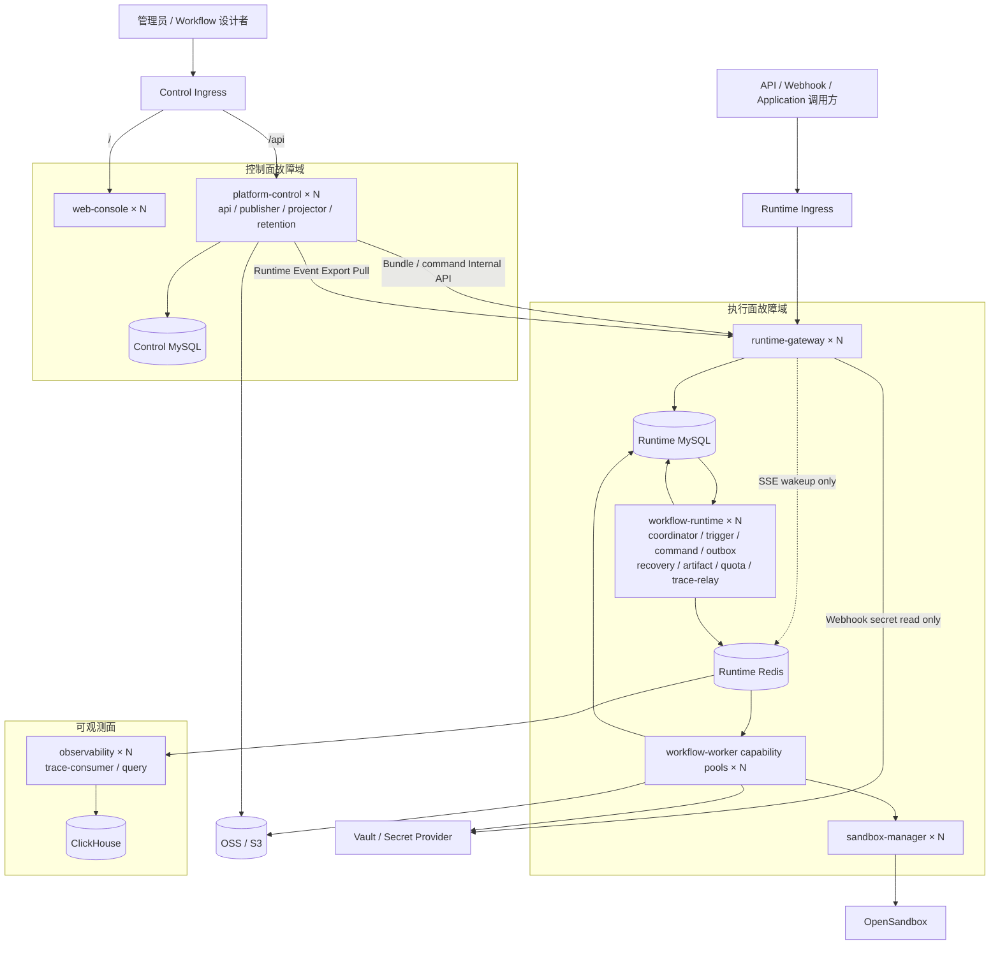

# V2 目标架构与决策

## 1. 架构目标

V2 的核心不是把当前表机械分到两个数据库，而是改变执行制品的生成时机：

```text
V1：Invocation 到达 → 查询控制配置 → 拼 Execution Snapshot → 执行
V2：控制面发布 → 生成并激活 Runtime Bundle → Invocation 只读本地 Bundle → 执行
```

执行面始终运行最后一次成功激活的 Bundle。控制面离线时不能进行新设计和新发布，但不能影响已发布版本。

V2-05 已把 Runtime Query、Control Pull Projector 与 Trace/Observability 链路落地。V2-06A 又完成全 Role Claim 审计、多副本强退、Drain、PDB 和紧凑 Profile `2→4→2`；V2-08A 已在最终本地三域拓扑补齐 151/151 公共 API、完整产品闭环并物理删除 V1，证据见 [Run `20260818-final4`](evidence/v2-08.md)。V2-07A 已实现外部托管 production Profile、三域独立运维、标准容器安全、Migration 与备份恢复契约，但真实外部 TLS/恢复 E2E 尚未执行。V2-06B 容量线、V2-07B 强隔离和 V2-08B 生产认证仍未完成。

## 2. 目标架构



图中的 Control、Runtime、Observability 是逻辑数据与权限边界；当前部署拓扑固定为三个物理 Namespace：Control 独立，Runtime 与 Observability 共用 `agentx-runtime`，共享依赖和专用 ingress-nginx 位于 `agentx-deps`。共用 Namespace 不改变 ADR-V2-001 至 ADR-V2-005 的数据所有权，跨 Role 权限继续由独立 Secret、ServiceAccount、Redis ACL、数据库账号和基于 Pod 标签的 NetworkPolicy 保证。

## 3. 固定架构决策

### ADR-V2-001：两个 MySQL 是两个故障域

- Control MySQL 和 Runtime MySQL 必须使用不同 Endpoint、账号、Secret、连接池和 Migration History。
- Runtime 服务不能持有 Control MySQL Credential；Control 服务不能直写 Runtime 业务表。
- 同一 MySQL 实例的两个 Database/Schema 不满足目标。

### ADR-V2-002：只部署 Runtime Redis

- Runtime Redis 是执行面必需基础设施，不能与控制面共享实例、连接池或 Key 空间。
- V2 不部署 Control Redis。Control 的耐久队列、发布任务、幂等、Claim/Lease、投影 Cursor 和低频全局协调统一使用 Control MySQL。
- Control 查询直接使用 Control MySQL，并允许带 TTL/Version 的有界进程内缓存；缓存只优化性能，不保存唯一状态。
- 普通 HTTP 限流和突发保护由 Ingress/API 本地令牌桶承担。只有 Bootstrap、登录失败、Key 创建等低频安全额度可以使用 MySQL 条件更新；禁止把每个控制面请求都写入数据库计数器，也不把 MySQL 当成热缓存服务器。
- Runtime Redis 只承载节点任务、Runtime Event 通知、SSE 唤醒和短期配额计数。
- Runtime Redis 丢失不能导致权威业务数据丢失；Control 永远不得为了省资源连接 Runtime Redis。

### ADR-V2-003：一个 OSS，通过安全域隔离

至少建立三个 Bucket 或等价独立前缀与 IAM Policy：

```text
agentx-control
agentx-runtime
agentx-observability
```

控制面不能覆盖 Runtime Artifact；Worker 不能写 Control Workspace；所有引用包含 Tenant、Hash、Size 和 Storage Domain。

### ADR-V2-004：ClickHouse 只属于可观测面

- ClickHouse 不参与 Invocation 接受、Execution 状态推进、幂等、Lease 或 Checkpoint。
- ClickHouse 故障时 Trace Outbox 在 Runtime MySQL 累积，恢复后补投。
- Runtime 终态查询不能从 Trace 推导。

### ADR-V2-005：Execution Spec Bundle 是唯一生产执行制品

Runtime Deployment Bundle 的不可变执行部分统一称为 `Execution Spec Bundle`。它至少包含：

- Bundle、Tenant、Application、Deployment、Workflow 和 Version ID。
- Workflow Definition、Compiled IR、Compiler Version 和 IR Schema Version。
- Node Manifest Snapshot 和所需 Worker Capabilities。
- Input/Output/Context Contract。
- Resource Binding、精确 Resource Version、Provider Endpoint 和 Secret Reference。
- Workflow Service Identity、授权快照版本和运行策略。
- Trigger、Schedule、Poll、Lifecycle 配置。
- Quota、Timeout、Retry、Artifact 和 Sandbox Policy。
- Bundle Sequence、Content Hash、Signature、Created At。

Bundle 必须包含执行所需依赖的传递闭包，不能只保存第一层 ID：

- Composite/Sub-workflow 的固定 Version、IR 和递归检测结果。
- Skill 指令、固定文件 Revision、依赖资源和 Runtime OSS Object Manifest。
- Model、MCP、RAG、Memory、Credential、Sandbox Profile 的精确运行版本。
- 每个 Runtime Object 的 Tenant、Storage Domain、Content Hash、Size 和 Media Type。

发布时必须把运行所需的 Control OSS 内容按 Content Hash 复制到 Runtime Storage Domain。Runtime Worker 不得通过 Control OSS Metadata 或 Control MySQL 解析运行文件。

Bundle 不包含 Secret 明文，也不引用 Control 数据库中的可变 Head。Bundle 不承载 API Key 当前状态、Application 禁用状态、Grant 撤销状态、Tenant 禁用状态或当前 Quota Epoch；这些属于独立的可变 Admission State。

### ADR-V2-006：发布采用 Prepare/Activate

发布流程固定为：

1. Platform API 在 Control MySQL 中创建不可变 Version 和 Bundle。
2. 同一事务写 `control_outbox`。
3. Bundle Publisher 调用 Runtime Internal API `prepare`。
4. Runtime 校验 Hash、签名、Schema、Capability 和全部引用后，在 Runtime MySQL 保存为 `prepared`。
5. Publisher 调用 `activate`。
6. Runtime 在单事务中校验 Activation Manifest、原子切换 `runtime_deployment_heads`，并保证 Route 与最低 Admission Epoch 已存在。
7. Runtime 返回激活序列，Control 标记发布成功。

未激活 Bundle 永远不接收生产请求。回滚是将 Head 指向一个仍受支持的旧 Bundle，而不是重写 Bundle。

Activation Manifest 只携带目标 Bundle、期望旧 Head Version 和初始/最低 Admission Epoch，不把可变 Admission State 混回 Bundle。首次激活缺少 Route、Key/Identity 或必要 Grant Projection 时必须整体失败；后续 Bundle 回滚只切换 Spec Head，现有 Admission Epoch 只能保持或前进。

### ADR-V2-007：跨面只允许 Internal API + Inbox/Outbox/Cursor

- 禁止跨库 JOIN、跨库外键和双库事务。
- Control→Runtime：Bundle、激活、禁用、撤权、API Key 和配额命令。
- Runtime→Control：Runtime MySQL/Event Log 保存 Invocation/Execution 终态以及 Approval、Evaluation、成本和告警事件；`platform-control --role=projector` 只按 Cursor 拉取控制面治理、通知和审计所需事件，不建立通用 Execution/Invocation 摘要表，也不由 Runtime 主动推送。
- Command 接收方使用 `event_id` 唯一 Inbox；Control Pull Projector 使用 `projector_name + event_id` Receipt，并在投影事务成功后推进 Control MySQL Cursor。
- Runtime Integration Event Log 按冻结的最大控制面离线时间保留；Cursor 落后于保留窗口时使用 Snapshot Export 重建治理投影，不允许临时直连 Runtime MySQL。它不是领域事实日志，不能用于重建 Runtime 当前状态。

### ADR-V2-008：授权采用本地投影和显式陈旧策略

- 新 Execution 和需要重新授权的 Attempt 查询 Runtime MySQL 的本地授权投影。
- 控制面撤权异步发送高优先级 Runtime Command。
- 默认可用性策略为 Last Known Good；安全租户可以设置 `max_policy_staleness`，超时后拒绝新 Execution。
- Vault 或 Provider 侧 Secret 撤销独立于控制面数据库并立即影响新 Secret 解析。
- V2 不承诺控制面网络完全中断时仍能获知尚未传播的撤权。

### ADR-V2-009：生产入口与控制入口分离

建议使用两个域名：

```text
console.agentx.example/     → web-console
console.agentx.example/api  → platform-control --role=api
run.agentx.example/         → runtime-gateway
```

Runtime 请求不得经过 Web Nginx。Studio Draft Debug 属于控制面能力，允许控制面故障时不可用。

V2-03 已固定公网契约为 `/gateway/v1`，并删除 V2-02 的临时 `/runtime/v1`。Runtime Ingress 不暴露 `/internal/runtime/v1`；浏览器从 Web 运行时配置取得 Runtime Base URL 并直连独立 Host。Gateway 可以连接 Runtime Redis，但仅用于 SSE Pub/Sub 唤醒，`invocation_events.sequence_number` 始终是权威 Cursor；认证、Route、Invocation 接受和幂等结果只依赖 Runtime MySQL。Webhook Secret 只通过版本化 Vault KV v2 引用和只读身份解析。

### ADR-V2-010：常驻服务支持多副本，紧凑 Profile 默认单副本

- 正确性不能依赖副本数为一。
- 在线服务不保存本地权威状态，不要求 Sticky Session。
- 后台任务必须使用 Claim Lease、Consumer Group、分区或 Leader Lease。
- Migration Job 是唯一不横向并行执行的程序。
- MySQL Claim 统一使用 Pod UID Owner、30 秒 Lease、10 秒 Heartbeat、批量上限 100 和数据库 UTC 时间；Heartbeat/Complete/Fail 必须校验 Owner、Fencing Token 与未过期 Lease。
- 常驻应用统一 Live/Ready/Drain 生命周期；Drain 立即摘除 Readiness、拒绝新写并停止新 Claim，已领取工作最多继续 45 秒，Pod 终止宽限为 60 秒。
- 紧凑 Profile 使用 `replicas=1,maxReplicas=4` 和 `PDB minAvailable=1`。`replicas` 只用于首次安装，单副本默认值降低开发和初始部署资源占用但不提供 Pod 级冗余；`maxReplicas` 只作为连接与外部依赖容量预算。Agentx 不创建 HPA/KEDA，不安装 Prometheus、Prometheus Adapter 或 Metrics Server；用户平台负责抓取 `9092 /metrics` 并自行扩缩容，Upgrade/Rollback 保留当前副本数。V2-06A 的历史 `2→4→2` 证明多副本、Drain 与 Lease 正确性，但不再定义当前默认副本数，也不能替代 V2-06B 容量门禁。

### ADR-V2-011：Execution Spec 与 Runtime Admission State 分离

Runtime MySQL 中明确区分：

1. **Execution Spec**：不可变 Bundle、IR、Manifest、Resource Binding、Trigger Spec 和运行策略快照。Deployment 回滚可以切换到旧 Spec。
2. **Runtime Admission State**：Application/Tenant 启停、API Key 当前版本、Policy Epoch、Grant 撤销、Quota Epoch 和 Provider Kill Switch。它们通过单调 Version/Epoch 更新。

回滚旧 Bundle 只能改变新 Execution 使用的 Spec Head，禁止恢复旧 API Key、旧 Grant、旧 Policy Epoch、旧 Tenant 状态或旧 Quota。创建 Execution 时必须同时固定 `bundle_id` 和当时使用的 Admission Epoch；历史 Execution 保留可解释性，但新 Attempt 是否需要重新授权由策略显式声明。

### ADR-V2-012：Bundle 生命周期、引用和垃圾回收

Bundle 生命周期固定为：

```text
building → prepared → active → superseded/disabled → retained → garbage_collectable
```

- `prepared` 只表示完整性和兼容性校验通过，不得接收生产请求。
- Runtime Head 切换必须使用期望 Head Version 和单调 Activation Sequence 做 CAS。
- Active Execution、Checkpoint/Fork Source、固定版本 Session、待恢复 Wait 和 Retention Hold 都会形成 Bundle Reference。
- 仍有 Runtime Reference 的 Bundle 和 Runtime OSS Object 不得回收；删除 Control Application 只能先发送禁用命令，不能直接删除 Runtime 历史事实。
- GC 使用 Mark/Sweep 或等价的可重试 Claim 协议，并保留可审计的删除清单。

### ADR-V2-013：跨面 API 是受控信任边界

“控制面与执行面隔离”是指数据库、Redis、凭据、入口和故障域隔离，不代表禁止所有受控 API 通信。只允许以下最小链路：

| 调用方 | 目标 | 用途 |
|---|---|---|
| `platform-control --role=publisher` | Runtime Publish Internal API | Prepare/Activate/Rollback/Disable 和 Admission Command |
| `platform-control --role=api` | Runtime Query API | 控制台实时详情 BFF |
| `platform-control --role=projector` | Runtime Event/Snapshot Export API | 按 Cursor 拉取审批、评测、通知和必要审计/告警事件；不复制通用 Execution/Invocation 列表、成本或 Runtime Status |
| Control Debug/Evaluation Orchestrator | Runtime Work Package API | 受控调试和评测执行 |

这些 API 使用独立 HTTPS Service/Port，不经生产 Runtime Ingress。V2 首期固定使用短期非对称 Service JWT 作为唯一调用方认证机制：每个 Control Role 使用独立私钥和 `kid`，Runtime 只持有公钥并校验 `iss/aud/sub/role/exp`；密钥支持双 `kid` 滚动轮换。Tenant/对象授权使用 Scope；写请求使用 Schema Version、Idempotency Key 和单调业务 Version 防重放/乱序。除 Bundle/Object 内容签名外，不再叠加 mTLS Client Identity、自定义请求签名、时间戳或 Nonce Store，也不为此引入 Service Mesh。NetworkPolicy 默认拒绝跨域，只为上述 Control 调用方和 Runtime 目标端口开白名单；Runtime Pod 永远不能访问 Control MySQL/Redis，也不需要 Control Service DNS、Credential 或跨面出口。

Platform API/BFF 完成 Control IAM 校验后，只能向 Runtime Query API 发送短期 Delegation Token，Token 固定 Tenant、Subject、允许的 Execution/Session/Application 范围、操作、过期时间和唯一 ID。Runtime 校验 Audience/Signature/Scope 并记录查询审计；Platform API 的工作负载身份本身不获得任意租户、任意 Execution 的查询权限。

### ADR-V2-014：Studio Debug 和 Evaluation 使用临时 Work Package

Studio Draft Debug 和 Evaluation 不要求创建生产 Deployment，但仍不得让 Runtime 回读控制面。Control 生成带 TTL、调用目的和调用方身份的不可变 `Runtime Work Package`，其 IR、资源闭包、对象复制、签名和兼容校验与生产 Bundle 使用同一 Builder。

- Debug Package 绑定精确 Draft Revision 和 Debug Overlay，只能进入隔离的 Debug Queue/Quota。
- Evaluation Package 绑定 Workflow Version、Dataset Version、Evaluation Profile Version 和 Case Identity。
- Work Package 不建立生产 Route/Head，到期后按 Runtime Reference 和 Retention 规则回收。
- Package 的创建、执行和结果投影都使用 Inbox/Outbox，不允许 Control 直接写 Runtime 表。

### ADR-V2-015：V2 内部版本支持滚动升级

V2 不兼容 V1，不代表 V2 可以忽略自身滚动升级。必须分别版本化 Bundle Schema、IR Schema、Compiler、Worker Protocol、Internal API 和 Event Envelope：

- Runtime Prepare 在激活前验证目标 Worker Pool 的兼容能力。
- 新服务至少支持当前版本和上一发布版本产生、且仍处于 Retention 的 Bundle/Event；具体窗口在 V2-00 冻结。
- 数据库变更采用 Expand/Contract；先部署兼容读写，再清理旧列，禁止同一滚动发布中先删除仍被旧 Pod 使用的 Schema。
- 不支持的旧 Bundle 必须在发布/回滚界面明确标记，不能等到 Invocation 后才失败。

### ADR-V2-016：Trace 数据库 Relay 属于 Runtime

读取 Runtime MySQL `trace_delivery_outbox` 的 Relay 属于 `workflow-runtime --role=trace-relay`，只把已 Claim 的 Trace Event 发布到 Runtime Redis Trace Stream。可观测面的 `observability --role=trace-consumer` 只消费 Redis 并写 ClickHouse，默认不持有 Runtime MySQL Credential。这样 ClickHouse/Observability 故障域不能反向获得 Runtime 业务库访问能力。

### ADR-V2-017：固定数据边界，控制进程拓扑

V2 固定的是 Control/Runtime/Observability 数据权威和安全边界，不固定“每个职责一个微服务”。首期应用构建产物预算为：

```text
web-console
platform-control          # api / publisher / projector / retention roles
runtime-gateway
workflow-runtime          # coordinator / trigger / command / outbox / recovery / artifact / quota / trace-relay roles
workflow-worker           # capability pools
sandbox-manager（可选）
observability             # trace-consumer / query roles
各存储 Migration Job
```

`publisher/projector/retention` 复用 `platform-control`，`coordinator/trigger/trace-relay/recovery/quota` 复用 `workflow-runtime`，`trace-consumer/query` 复用 `observability`。Role 可根据网络权限和负载拆成多个 Deployment，但共享二进制、配置模型、Claim 库和发布版本。

默认紧凑 Profile 按“一类应用构建产物一个 Deployment”部署，由同一进程以 `--roles=...` 或等价配置启动 Role 集合，不为 Role 添加 Sidecar；多个副本仍通过 Claim/Lease、Consumer Group 和 Leader Lease 协作。Role 拆分属于有证据后的部署优化，不是 V2 的前置条件。首期不得预先渲染一组无人维护的空闲 Role Deployment，也不得因为未来可能扩容就提前增加网络跳转。

只有服务拆分门禁证明独立安全权限、扩缩容、故障域或发布节奏收益时，才允许超过上述 7 类构建产物或新增 Internal API。禁止仅因模块名称不同就创建新网络跳转。

## 4. 故障行为

| 故障 | 必须行为 |
|---|---|
| Web/Platform API 全部不可用 | 已发布生产调用、SSE、Cancel、Resume 正常；新设计和发布暂停 |
| Control MySQL 不可用 | 执行面使用已激活 Bundle；跨面命令暂停，恢复后 Control 按 Outbox/Cursor 续传 |
| Runtime Redis 不可用 | 已提交状态不丢失；派发暂停或有界失败；恢复后从 Outbox 补投 |
| Runtime MySQL 不可用 | 不接受无法持久化的新请求；在途任务停止提交；恢复后通过 Lease/Reaper 收敛 |
| OSS 不可用 | 不需要 Artifact 的节点可继续；需要大载荷的节点按明确策略失败/重试，不能静默丢数据 |
| ClickHouse 不可用 | Workflow 正常执行，Trace 查询降级，恢复后补投 |
| Vault 不可用 | 需要 Secret 的新调用有界失败/重试；禁止回退数据库明文 |
| Worker/Coordinator Pod 强退 | Lease 到期后由其他副本恢复，不无条件重复完成节点 |
| 控制面恢复 | Inbox/Outbox 幂等补同步，不重复消息、审批或评测结果 |

## 5. 明确不做

- 不实现 Control/Runtime 跨区域多活。
- V2 不引入 Kafka、Pulsar 或 NATS，也不为它们预留抽象层；Control/Runtime 跨面使用 MySQL Outbox/Inbox/Cursor，Runtime 节点和 Trace 派发使用现有 Redis Stream。
- V2 不采用 Event Sourcing。领域表和 Runtime 状态机表保存当前权威状态，Event/Outbox 只用于集成、审计和投影，不作为重建 Execution 聚合的唯一事实来源。
- 不追求外部副作用通用 Exactly Once。
- 不支持旧数据库原地升级或旧 V1/V2 双写。
- 不保留旧共享 MySQL 模式的 Feature Flag。
- 不为旧内部 gRPC、Runtime Event、OpenAPI 或部署 Profile 提供兼容代理。
